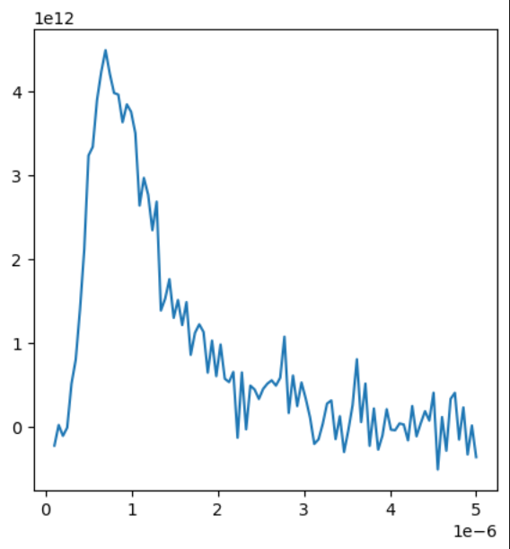
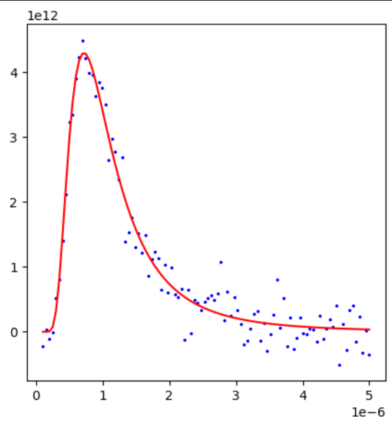

# Assignment 3 - Data Estimation

## Objective
From the noisy data provided in `d1.txt`, `d2.txt`,  `d3.txt` and `d4.txt`, curve fit to the planck's equation for radiation to obtain the value of unknown variables  

$B = \frac{2hc^2}{x^5} \frac{1}{e^\frac{hc}{xkT}-1}$  &nbsp;&nbsp;&nbsp;&nbsp; (1)   

We have to try to find the values of h, c, k and T  

## Solution

### 1. Reading input from file

Read the csv file using the reader function from csv library
```
import csv

file = open('d3.txt', 'r')
reader = csv.reader(file)
```
Convert the csv data into list and then into a numpy array in float datatype.
```
data = list(reader)
data = np.array(data, dtype=np.float64)
```
slice the data to obtain x and y
```
x, y = data[:, 0], data[:, 1]
```

### 2. Bundling of variables

The variables can be bundled into two variables for curve fitting  
$a = 2hc^2$  &nbsp;&nbsp;&nbsp;&nbsp; (2)  
$b = \frac{hc}{k_bT}$ &nbsp;&nbsp;&nbsp;&nbsp; (3)   

Then the equation becomes  
$B = \frac{a}{x^5} \frac{1}{e^\frac{b}{x}-1}$&nbsp;&nbsp;&nbsp;&nbsp; (4)   

It is important to note that the individual values of h,c,k and T cannot be obtained from curvefitting. This is because, there are infinite possible combination of the variables which would give the same graph.

But if we know the value of some of the variables in prior, then we might be able to get the value of other variables


### 3. Scipy curve fitting
Define the function to be curve fitted
```
def f(x,a,b):
    return (a/x**5)/((np.e**(b/x))-1)
```
Use `curve_fit` function from scipy library to obtain the values of a and b
```
from scipy.optimize import curve_fit
(a,b), pcov = curve_fit(f,x,y,p0=[a0,b0])
```

### 4. Initial Guess
In order for curve_fit to give accurate fit and not overflow, it is necessary to give a considerably good initial guess   

I obtained my guess using the maxima of the function.  

The maxima of the function
$B = \frac{a}{x^5} \frac{1}{e^\frac{b}{x}-1}$
is at  
$x_{max} = \frac{b}{4.965}$    &nbsp;&nbsp;&nbsp;&nbsp; (5)   
(reference - [wikipedia Link]( https://en.wikipedia.org/wiki/Wien%27s_displacement_law#Parameterization_by_wavelength)) 

- we can get obtain the point of maximum y from the data and substitute $x_{max}$ to get the initial guess $b_0$.
- Subsituting $b_0$, $x_{max}$ and $y_{max}$ in the equation we get $a_0$
- a0 and b0 thus obtained were pretty close to the their actual values for all the datas
- __Note that as I am not performing the guess manually, this code will work for data of any temperature value seamlessly__

```
b0 = 4.965*xmax
a0 = ymax*((np.e**(b0/xmax))-1)*(xmax**5)
```
where xmax and ymax can be obtained by
```
imax = np.argmax(y)
xmax = x[imax]
ymax = y[imax]
```
### 5. Results
- When I ran curve fit for `d1.txt` I got the following values for a and b:  
$a = 1.159*10^{-16}$  
$b = 3.559*10^{-06}$    

  


- The initial guess from maxima were
a0 = 1.029e-16, b0 =3.445e-06, which were quite close 
- Assuming the graph was obtained with actual c and h values, the correct value of a should be  
$a_c = 2hc^2 = 1.191*10^{-16}$
- Thus the value obtained is pretty accurate
- The theoretical value of b cannot be calculated directly as the temperature parameter is not provided
- From equation (3) we can obtain temperature as  
$T = \frac{hc}{k_bb} = \frac{0.0143}{b}$  
- substituting b, we get temperature of the body as
 $T = 4041K$  
 which is a pretty realistic value. 

### 5. Evaluation

#### 5.1 Covariance
- Eventhough the obtained parameters were good, a more reliable method of evaluation will to be evaluate the curve fit itself
- For this the curve_fit function returns the covariance matrix. The diagnols of the covariance matrix represent the variance of the individual variables
- Here is the covariance matrix I got for `d1.txt`
 ```
[[4.07816757e-35 2.52158469e-25]
 [2.52158469e-25 1.72076378e-15]]
 ```
 - The variance of a and b are pretty low but it is not convey anything, as it is important to consider the scale of a and b as well

- So we calculate the relative standard deviation:
```
perr = np.sqrt(np.diag(pcov))
relative_std_dev = (perr/np.abs(popt))*100
```
output:  
a - __5.5%__   
b - __1.16%__  
Which are good values

#### 5.2 R-Square
- R-square of a curve fit is defined as  
$SSR = Sum((y_i-Y_{i})^2)$  
$SSR = Sum((y_i-y_{mean})^2)$  
$R^2 = 1 - \frac{SSR}{SST}$
- A good curve fit has R-square close to 1
- If R-square is closer to zero, it means that fit has the same result as taking all the datapoints to be mean value
- If R-square is negative, then the curve fit is worser than that
```
y_fit = f(x,a,b)
ss_res = np.sum((y - y_fit) ** 2)
ss_tot = np.sum((y - np.mean(y)) ** 2)
r_squared = 1 - (ss_res / ss_tot)
```
- The R-square value of d1.txt came out to be __95.87%__, indicating a good curve fit

### 6. Table
|  data  |     a     |     b     |     T     |  R-square  |  a_rsd   |  b_rsd   |
|:------:|:---------:|:---------:|:---------:|:----------:|:--------:|:--------:|
|d1.txt  |1.159e-16  |3.56e-6    | 4041      |95.87       |   5.50   |   1.16   |   
|d2.txt  |0.770e-16  |3.33e-6    | 4310      |16.97       |   72.15  |  15.25   |           
|d3.txt  |1.130e-16  |3.58e-6    | 4042      |95.29       |   1.84   |   0.39   |   
|d4.txt  |1.126e-16  |3.64e-6    | 3948      |12.08       |  20.79   |   4.39   |   

The R-square is low for d2 and d3 owing to the large amount of relative noise in the data. It can also be observed that the parameters can be better estimated with more datapoints

## Methods to reduce error

### 1. Smoothening
Applying gaussian filter, the graph can be smoothened and the effect of outlying points can be reduced.
```
from scipy.ndimage import gaussian_filter1d
y= gaussian_filter1d(y, 1.0)
```
|  data  |     a     |     b     |     T     |  R-square  |  a_rsd   |  b_rsd   |
|:------:|:---------:|:---------:|:---------:|:----------:|:--------:|:--------:|
|d1.txt  |1.166e-16  |3.57e-6    | 4030      |98.74       |   2.98   |   0.63   |   
|d2.txt  |0.770e-16  |3.34e-6    | 4298      |35.90      |   43.56  |  9.21     |     
We can observe the R-square has increased and the relative standard deviation have increased significantly.

### 2. Partial fitting
We can fix a and curve fit only for b.
let $a=2hc^2 = 1.191e-16$  
  
|  Data   |      a       |      b       |      T      |  R-square  |  b_rsd  |
|:-------:|:------------:|:------------:|:-----------:|:----------:|:-------:|
| d1.txt  | 1.191e-16    | 3.58e-6      |   4013      |   98.74    |   0.19  |
| d2.txt  | 1.191e-16    | 3.64e-6      |   3945      |   34.85    |   2.69  |

We observe similar values across the datasets. However, this time, the fit function is more confident about its predictions, as reflected in the higher R-square value for `d1.txt`.

### 3. Slicing data
I took only the first half of the data disregarding the second half and vice versa. In the former case, the values were slightly better but in the later random values were obtained. 

This is because, the first half has more features than the later part which is mostly noise

### 4. Custom data
I created my own data by calling the same function and adding some gaussian noise. It is added as a commented block in the .ipynb file.  

I tried calling the function with different values of a and b and different amplitudes of noise. The output were quite accurate, indicating the reliability of model

*THANK YOU*