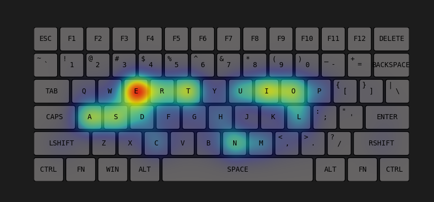
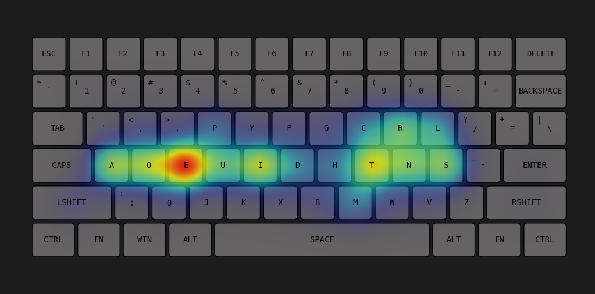
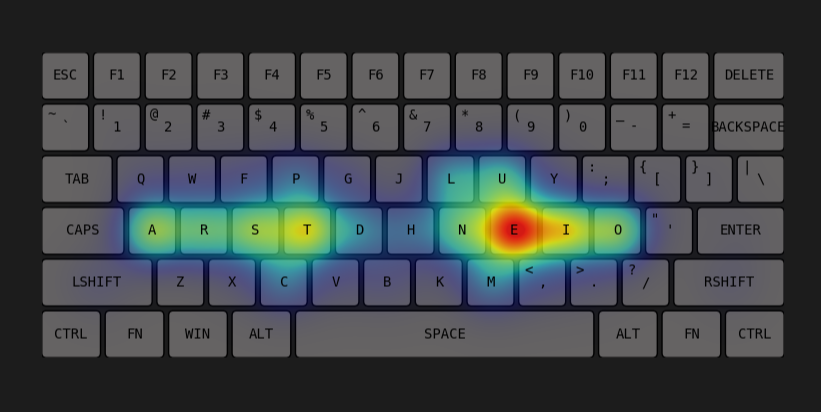
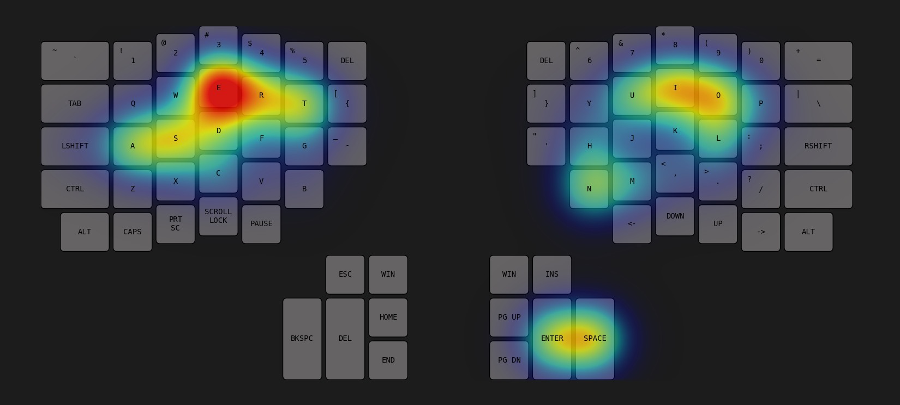

# Assignment 4 - Keyboard analysis
## Bhavesh S (EE23B016)

## 1. Layout
- I have used a __Custom layout__ for my code
- Layout is present in `layouts.py` which is imported in the main python script
- Here is the structure of the layout
```
keyboard_layouts = {
    'qwerty': [
        {'chars': ['q', 'Q'], 'position': (1.6, 2.8), 'dimensions': (1, 1), 'side': 'L', 'start': 'a'},
        {'chars': ['w', 'W'], 'position': (2.7, 2.8), 'dimensions': (1, 1), 'side': 'L', 'start': 's'},
        {'chars': ['e', 'E'], 'position': (3.8, 2.8), 'dimensions': (1, 1), 'side': 'L', 'start': 'e'},
        {'chars': ['r', 'R'], 'position': (4.9, 2.8), 'dimensions': (1, 1), 'side': 'L', 'start': 'u'},
        {'chars': ['t', 'T'], 'position': (6.0, 2.8), 'dimensions': (1, 1), 'side': 'L', 'start': 'u'},
        ...
```
- It contains the character present within each, key, its position and dimensions as well. It allows me to add intricate details to my keyboard
- It also says wether the key is in the right side or the left side of the keyboard, so that I can assign the shift in the opposite side
- I have provided the following layouts- *QWERTY, Dvorak, Colemak, Ergodox(qwerty)*
- The first three have the same key positions while Ergodox is a split keyboard
- I generated the above layout from the basic order of the keys using a separate python script (and did some manual adjustments)


## 2. Data structure
- I created a class to store the information about each of the keys including its position, frequency, etc.
- They keyboard is stored as list of objects of this class
- I also created a map named `key_indices` which maps each character to the indice of its key in the list
- This allows me to easily access the key when a character is typed

## 3. Keyboard display
-  The code iterates through each key in the list and displays the key using the position and dimension information
- I have used a dark background and grey keys to highlight the heat map over it
- They keys are basically rectangles. I have added curved corners using the `FancyBboxPatch` feature of matplotlib
- The key character and the shift character are displayed over the keys

## Heatmap 
- The heatmap is created dynamically based on the frequency of each key. The key with maximum frequency is assigned a value of 1 and the weight decreases and becomes zero for the keys which have not been pressed
- The shift keys are also considered in the heatmap (the shift key in the opposite side of the keyboard)
- I have ignored the *SPACE* key in heatmap (not in travel distance)for better visualisation
- numbers and special symbols are included
- The `create_radial_gradient()` functions creates a gradient with the key as the centre
- this is done using numpy functions and vector addition
- A greyscale numpy array is made to which the weight around each key is added to
- The weight around each is a gaussian function. An alpha_mask numpy array also stores a gaussian distribution which is used to indicated the opacity of the pixels
- The `colorize()` function takes the grayscale mask and converts it into a RGBA mask by also including the alpha parameter
- I have used the matplotlib's `jet` colormap as it gives col(purple) to hot(red) gradient
- As a result, the gradient around the key becomes cooler and also fades away
- Superimposition of nearby keys to form contours also takes place

## Travel distance
- travel distance is stored for each key in the beginning of the program. 
- it is calculated as the distance between that key and its __start__ key
- While iterating through the characters of the string, the travel distance of each key is added to a variable
- If the characters requires *SHIFT*, the travel distance of corresponding shift key is also added

## Animation
- The run command as an `animate` options which animates the characters sequentially by enlarging the current key

## Live input
- It allows the user to dynamically type in strings, which will be added to the heatmap after pressing enter.
- it also allows the following special commands
```
clear       # clears and resets the heatmap and travel distance
quit        # ends the program
```
## Files Submitted
```
zip file
    /~ layouts.py - contains the layouts of the keyboards
    /~ ee23b016.py -  contains the python script
    /~ ee23b016.ipynb -  contains the same python script (without animation or live input) for easy visualisation
    /~ README.md
```

## Comparitive Layout Analysis
I calculated the travel distance for all the four types of keyboards on a large text (~28,000) characters, and obtain the following result
| Layout | Travel Distance |
|:------:|:---------------:|
|QWERTY  |22779.86         |
|Dvorak  |14848.64         |
|Colemak |12782.07         |
|Ergodox |23710.88         |

Inferences:
- Qwerty is very inefficient compared to other layouts
- Colemak is better than Dvorak
- Ergodox(qwerty) has slightly higher travel distance than Qwerty due to the staggered structure of the keys. It focusses more on the comfor to use than the travel distance.
- We can expect dvorak-ergodox and colemak-ergodox split keyboards to follow the same trend and have slightly higher travel distance than their normal versions

## Outputs

#### QWERTY


#### Dvorak


#### Colemak


#### Ergodox



