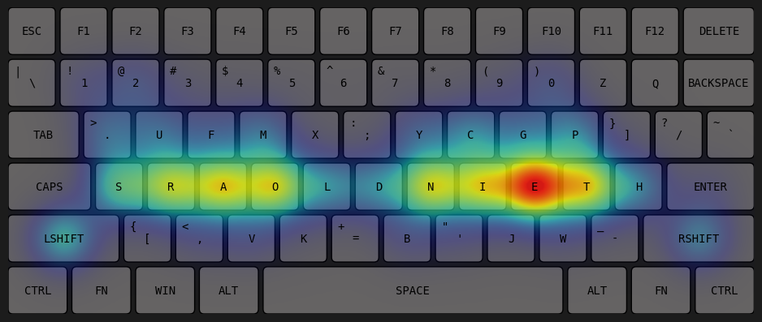
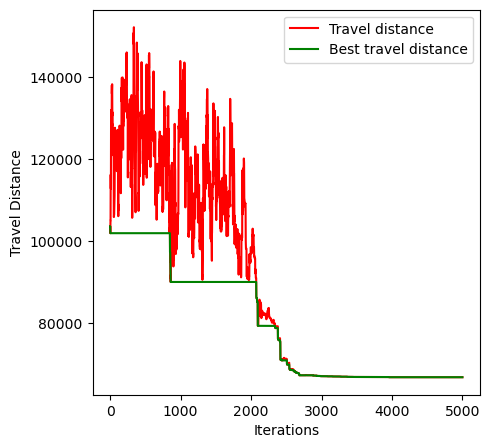
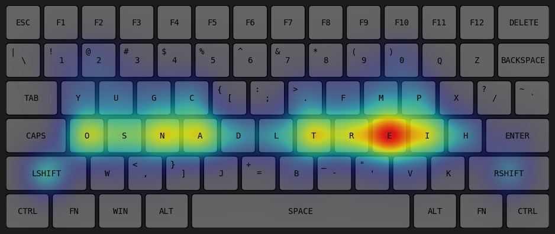
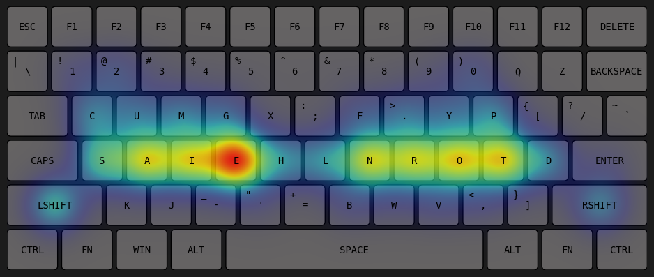
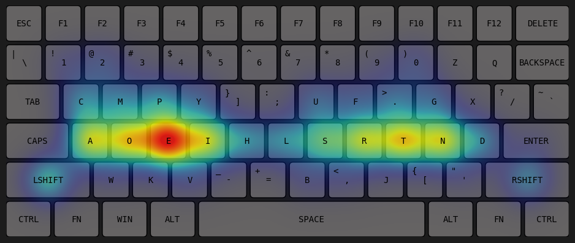
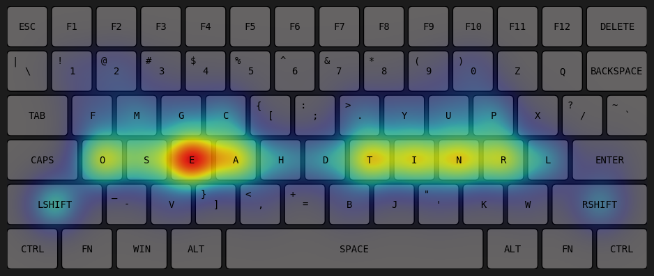
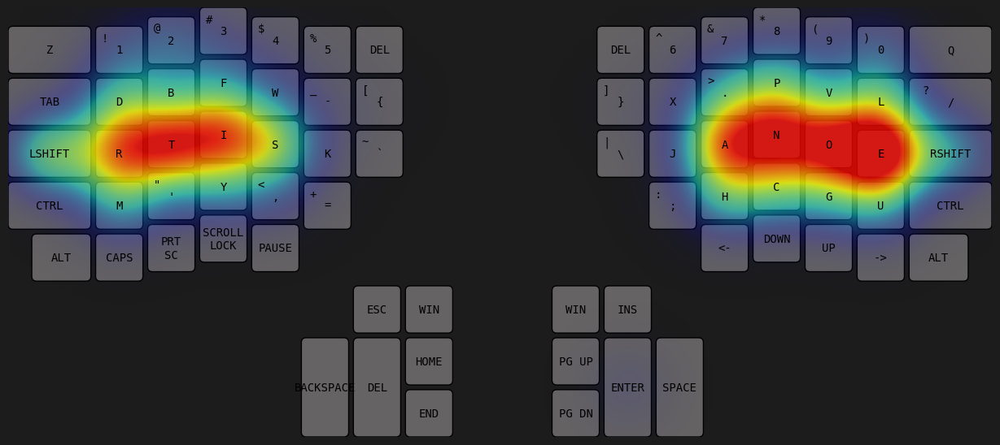
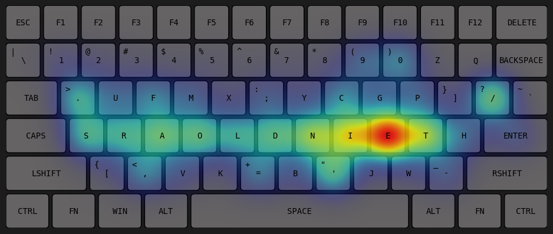

# Assignment 5
# Keyboard layout optimization

## Keyboard Layout
- I have used the same layout as the last assignment which I  generated myself
```
keyboard_layouts = {
    'qwerty': [
        {'chars': ['q', 'Q'], 'position': (1.6, 2.8), 'dimensions': (1, 1), 'side': 'L', 'start': 'a'},
        {'chars': ['w', 'W'], 'position': (2.7, 2.8), 'dimensions': (1, 1), 'side': 'L', 'start': 's'},
        {'chars': ['e', 'E'], 'position': (3.8, 2.8), 'dimensions': (1, 1), 'side': 'L', 'start': 'e'},
        {'chars': ['r', 'R'], 'position': (4.9, 2.8), 'dimensions': (1, 1), 'side': 'L', 'start': 'u'},
        {'chars': ['t', 'T'], 'position': (6.0, 2.8), 'dimensions': (1, 1), 'side': 'L', 'start': 'u'},
        ...
```
- It contains the character present within each, key, its position and dimensions as well. It allows me to add intricate details to my keyboard
- It also says wether the key is in the right side or the left side of the keyboard, so that I can assign the shift key in the opposite side
- The layout is imported from `layouts.py`. The folowing layouts are available - 'QWERTY', 'Dvorak', 'Colemak', 'Ergodox', 'best_layout'.
- The last layout was created from this code

## Keyboard Display
- `display_keys` function displays the keys while `draw_keyboard_layout` function displays the heatmap over the keyboard
- It is again same as the last assignment but there is one change
- It takes an `order` argument which tells the order of the keys. It is used to display the modified keyboard.

## Input processing
- The input is a string which is taken from `string.txt`
- It is made sure that unusual characters are not read from the file
- `calc_frequency` function takes the string and calculates the frequency of each key
- The frequencies are stored in `char_freq` list, for further use 

## Simulated Annealing
#### Swapping keys
- The annealing process starts with the given layout (qwerty, ergodox, etc), which is represented by a list of indices (`order`).
- In each iteration, we swap two keys randomly using the `get_neighbour` function
- I have allowed the function to only swap the alphabet and puncutation keys
- The numeric and control keys remain fixed as I felt moving those keys would just make it harder to type for the user

#### Evaluating travel distance
- In the beginning of the program, the travel distance of each key in the keyboard is calculated and stored in `key_travel` list. It does not change with the swapping of the characters
- After each swap, we calculate the total travel distance of the new layout
- This is done by `calc_total_travel` function by multiplying the frequency of a character (stored in `char_freq`) with the travel of its current key (stored in `key_travel`) for each key and summing up

#### Updating layout
- If the new total travel is less the the previous total travel then the layout is updated 
- else we proceed with the previous layout
- We also calculate a probability `p` using he current and previous travels
- With probability `p` the layout is updated regardless of wether the travel distance is better or not
- The probaility `p` is decreased with iterations with a factor `cooling_rate`

After performing the specified number of iterations, the optimized order is obtained

## Animation
- Animation is done using matplotlib's `funcAnimation`.
- Same structure as given by sir is used
- The interval is such that the total time for animation is 10 seconds irrespective of the number of iterations
- the run function has an `animate` parameter which toggles the animation display
- Animation can be rendered till 600 iterations but not more that that

## Saving
- the optimized keyboard can be saved into a text file for later use using the ` 
## Output
I trained on a large dataset(`string.txt`) with __1,00,000 characters__ for __10,000__ iterations and obtained the following optimized layout



- It is apparent that the high frequency keys are place in the home row for minimizing the travel distance
- The graph of travel distance while performing annealing is as follows



- The layout of the above keyboard is stored as `'best_layout'` in __layouts.py__
- The travel distance reduced from 10.3k to 66.8k, that is by __35%__
- On running the annealing multiple times, similar layouts are obtained, meaning the layout is as optimized as it can be







- Also the decrease in total travel distance is lesser when starting from dvorak and least when starting from colemak, again proving that they are better layouts

### Ergodox layout
On doing the same procedure for ergodox architecture, the following layout si obtained for the same text



### Programmer keyboard
- Here I considered numerical keys along with the character and punctuaion keys
- This is layout is suitable for programmers
- I trained it with text from several programming languages saved in `programming_string.txt`



## Files Submitted
```
zip file
    /~ layouts.py - contains the layouts of the keyboards 
    /~ ee23b016.ipynb -  contains the ython script 
    /~ string.txt - data for training
    /~ programming.txt - data for training programming layout
    /~ README.md
```