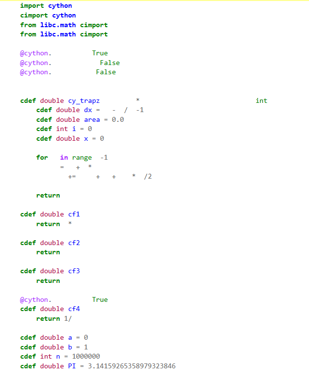

# Assignment 6
# Speeding up with Cython

### Pure Python Implementation
```
def py_trapz(f, a, b, n):
    dx = (b-a)/(n-1)
    area = 0
    for i in range(n-1):
        x = a + i*dx
        area+=(f(x)+f(x+dx))*dx/2
    return area
```

- This function takes __f__  (the function to be integrated), __a__,__b__ (the range) and __n__ (no. of sample points) and performs trapezoidal integration.

- in each iteration the ith and (i+1)th points are taken and the area of trapezium formed by them is added to the total area

- The function returns the total calculated area  


### Numpy Implementation

```
def np_trapz(f,a,b,n):
    x = np.linspace(a,b,n)
    y = f(x)
    areanp = np.trapz(y,x)
    return areanp
```
- It creates numpy array(__x__) of sample points using the `linespace` function, and stores the corresponding function values in __y__
- Trapezoidal area is calculated using the builtin in `trapz()` function, which takes __x__ and __y__ as input
- Returns the total area  
  

### Cython Implementation

#### 1. Loading Cython
- `%load_ext Cython` Loads the cython extension to the Jupyter notebook
- `%%cython` cell magic command compiles the python code in the given cell in cython
- `-a` flag gives an annotation of how much of the code translates to __C code__
- `import cython` provides cython decorators for functions
- `cimport cython` allows other cython functionalities like C-level declarations

#### 2. Function definition
```
cdef double cy_trapz(double (*f)(double),double a,double b,int n):
```
- I have defined return value as a C __double__ using `cdef`
- The limits are __double__ and number of sample points is an __int__
- The input function is a *function pointer* which takes __float__ as a parameter and return __float__
- The fixed type definitions makes the function less flexible but faster

#### 3. Defining Variables
- I have used `cdef <Type>` to define each variable including the iterator *i* and area accumulator *area* 
- The type of the variable cannot be changed further inside the function

#### 4. Function Decorators
- `@cython.cdivision(True)` : It removes the __Zero-division check__ performed by python, making integer divisions faster
- `@cython.boundscheck(False)` : While accessing list elements,Python usually checks for out of bound cases unlike C. This is disabled with this decorator
- `@cython.wraparound(False)` : disables negative array indexing

#### 5. Integrand functions
- The integrand functions are also defined in c level for further optimisation.
- Return value and input parameter are defined as double
- For *sin* and *exp* functions I have used the __libc__ libary which replicates c functions

#### 6. Evaluation
- The functions are called with c-type variables, `cy_trapz(cf1,a,b,n)`
- I have calculated the execution time using `time` libary in python. I couldn't use %%timeit as it cannot be called within a cython block
- The calculated area and the time taken are printed for each function
- All lines are in the cython annotation are white (no yellow lines) indicating maximum optimisation  
  

#### 7. Comparision
| Function | Limits | Sample points | Pure Python |  Numpy  |  Cython  |   
|:--------:|-------:|:-------------:|:-----------:|:-------:|:--------:|
| x*x      |(0,1)   |1e6            |217.3 ms     |16.54 ms | 7.49 ms  |
| sin(x)   |(0,PI)  |1e6            |1667.36 ms   |23.21 ms | 29.19 ms |
| exp(x)   |(0,1)   |1e6            |1608.81 ms   |20.56 ms | 16.55 ms |
| 1/x      |(0,1)   |1e6            |237.82 ms    |14.82 ms | 6.16 ms  |
| x*x      |(0,1)   |1e7            |2335.81 ms   |156.46 ms| 62.89 ms |
- Looking at the latency of pure python, numpy and cython implementations simulateously, it is clear that:  
    i. Cython is __much faster__ than pure python  
    ii. Cython is __considerably faster__ than numpy function

- When we compare the output value of the area, all three implementations give the same value upto __11 decimal places__
- Hence Cython optimises the calculation without comprimising on the accuracy

__NOTE__: The report has extended to three pages due to the attached images and codes, and the formatting.
