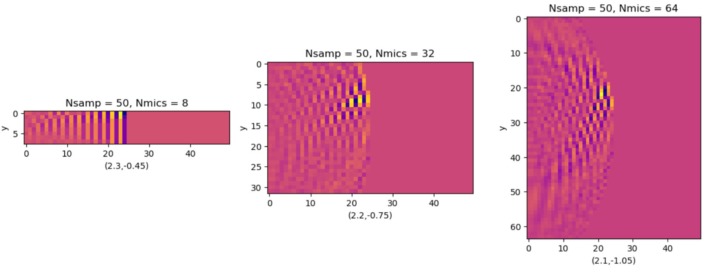

# Assignment 7
# Sound Localisation

### Finding mic positions
- All the functions and variables are enclosed within a class `Setup`
- The function `find_mic_positions()` finds the positions of the mics using *Nmics* and *pitch* 

### Generating Mic Data
- Calculate the distance from source to obstacle and obstacle to mic and add
- On dividing the distance by speed of sound, we obtain the time taken by the source's sound to reach the mic
- We can shift the source signal by this delay to get the mic's data
- `plot_mic_data()` plots the mic data as a colormap for visualisation

### DAS
- For performing DAS, we iterate through each point in our scope and assume that the obstacle is present at the point
- We calculate the sum of distances from the point to the source and from mic and add them
- We can divided by `dist_per_samp` and take floor to obtain the index of the datapoint of the mic corresponding to the delay
- We repeat the same for all the mics and add the mic datas
- In case the obstacle is present in the given point, all the datas will correspond to the maximum of the sinc wave and hence we get a maxima at that point

## Questions 

### Question 1
I am answering this question assuming it as the signal received by a microphone and x axis represents the samples. The are two ways to perform the required transformation
1. First you can increase __SincP__ of the sinc function, which would decrease the time period of the sine part
2. Decrease the __distance per sample__ parameter, which would basically increase the sampling rate, does providing the required scaling

### Question 2
- __(Nsamp/2)*dist_per_sample__ is a reasonable limit. This is because, assuming that the signal reflected by the obstalce reaches the mics, it would take atleast Nsamp/2 samples for the sound to reach the obstacle and another Nsamp/2 samples for the reflected signal to reach the mics. 

- So the maximum distance from the source where the obstacle can be is (Nsamp/2)*dist_per_sample

- But it can be decreased further. All the mics should be able to receive the signal which is not possible if the obstacle is at Nsamp/2. Therefore the maximum diagnol distance should be Nsamp/2

- Let YMICS be the total length occupied by the mics. and the dignol length is Nsamp/2. There fore the minimum upperlimit that we must consider is __sqrt(YMICS^2+(Nsamp/2)^2)__
- We can also dynamically calculate the maximum location of the obstacle by looking at the sample where the last maxima occurs in the input data

### Question 3
- As explained above in the DAS section, the delayed sum will be maximum where the obstacle is present
- Yellow color at (22,7) represent maximum amplitude among all the points, therefore clearly the obstacle is at that point

### Question 4
- Let the source be at __(0,0)__, and the mics farthest from the source be at __(0,Y)__ and __(0,-Y)__
- The sum of the distance of the obstacle from the source and the mics(farthest ones)
- First consider the topmost mic, the locus for the above condition to be satisified is an ellipse with (0,0) and (0,Y) as the focii.
- Similarly for the bottommost mic, the locus will be an ellipse with (0,0) and (0,-Y) as the focii.
- Hence the locus of the points in space where the obstacle can be placed is the area under the intersection of the ellipses.

### Question 5
- When we decrease C, the sound wave passes through the mic more slowly
- Therefore we get closely placed samples of the sinc function, making the data look more clearer

### Question 6
- I have placed the obstalce at `(3,-1)` and ran the code for the provided *Nsamp*s amd *Nmics*. Here are the results
- Nsamp increases the range over which the obstacle can be detected. For Nsamp = 500, the object is covered in the range, so we don't get the correct position
- We can also observe that increasing Nmics increases the accuracy of the maxima providing closer result to the actual position.

  

### NOTE
I have also uploaded a code named `sloc.py`   
I misunderstood the assignment initially and performed DAS by assuming we don't know the location of the source. It was harder more interesting though. and it has cool animations, so please check it out if possible.